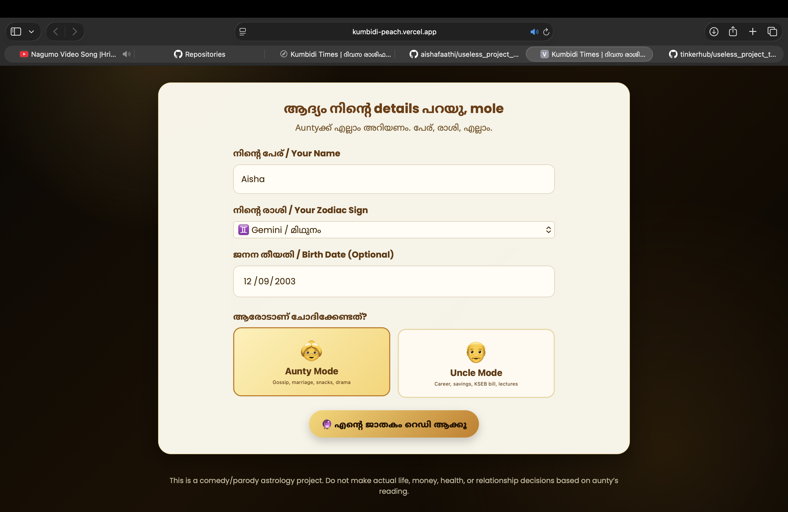
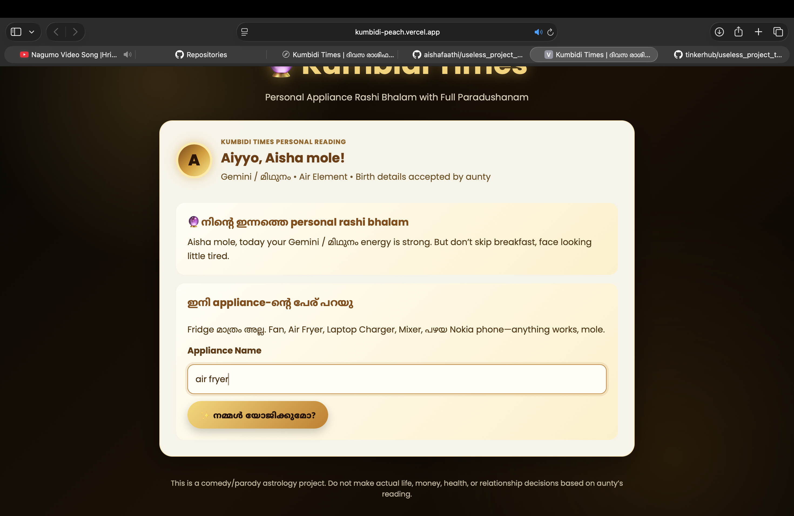
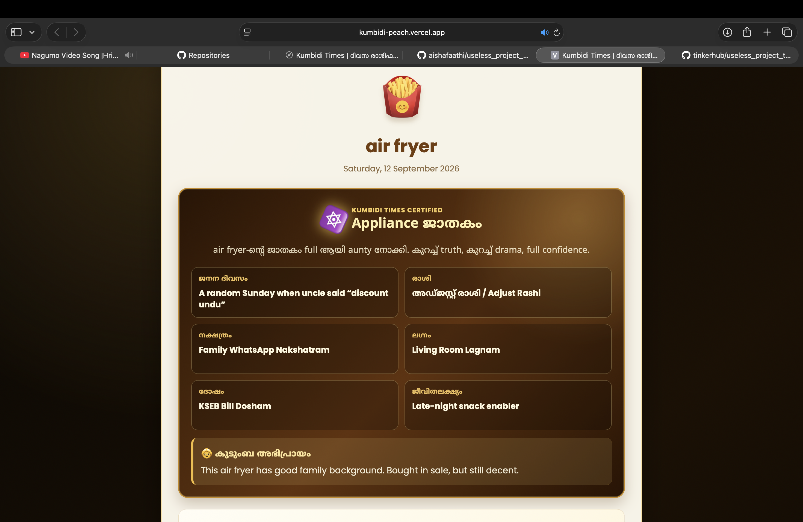
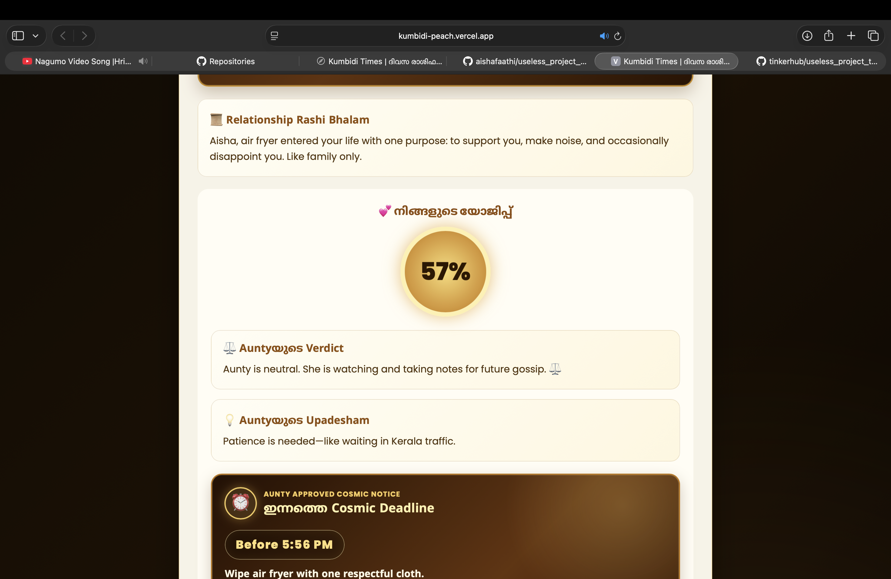
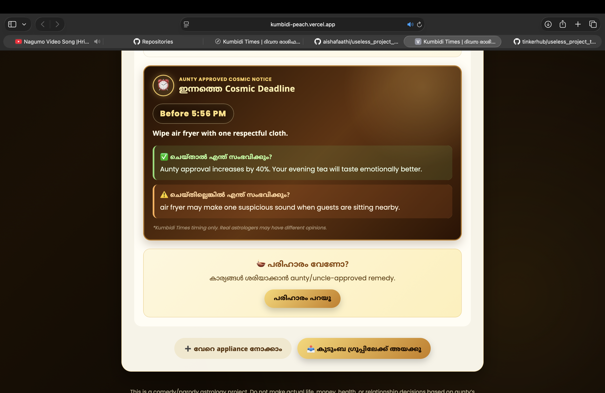
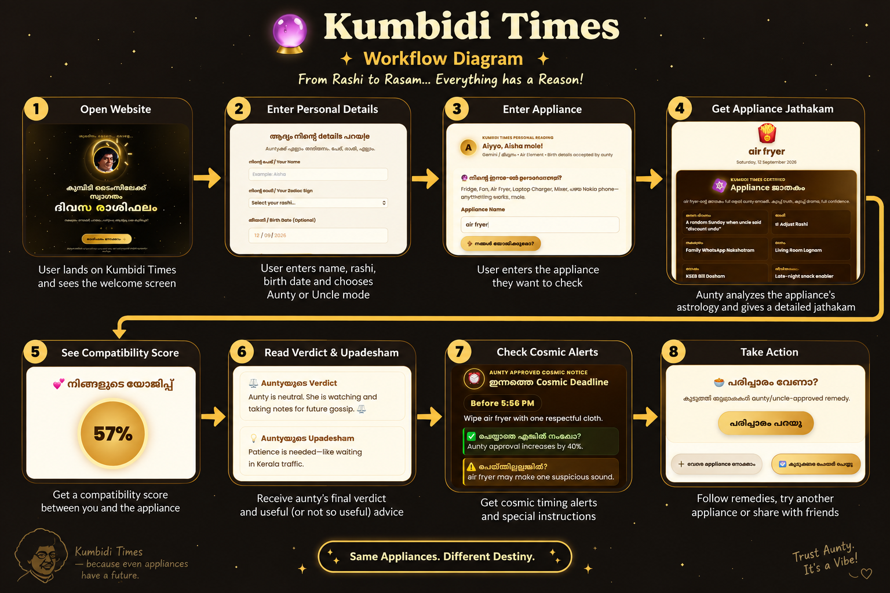

# Kumbidi Times 🔮


---

## 🎯 Basic Details

### Team Name

Chee kunchi

### Team Members

- **Team Lead:** Parvathi KS - `[College Name]`
- **Member 2:** Aisha Fathihah - `[College Name]`

---

## 🔮 Project Description

**Kumbidi Times** is a deliberately useless Malayalam/Manglish “appliance astrology” web application.

Users enter their personal details and select a household appliance such as an air fryer, fridge, fan, mixer, or laptop charger. The application generates a fictional **Appliance Jathakam**, compatibility score, aunty and uncle verdicts, cosmic warnings, remedies, and dramatic timing alerts.

Because apparently, even your air fryer has a destiny. 😌🔮

---

## 😂 The Problem (that doesn't exist)

Have you ever wondered whether your **air fryer is compatible with your rashi**?

Probably not.

That is the problem.

People already have enough astrology for:

- Love ❤️
- Marriage 💍
- Career 💼
- Money 💰
- Family 👨‍👩‍👧‍👦

But nobody is checking the horoscope of their **mixer grinder**.

What if your fridge has a bad planetary alignment?

What if your air fryer is secretly causing family drama?

What if your laptop charger and your rashi are simply incompatible?

These extremely important questions were being ignored.

---

## 💡 The Solution (that nobody asked for)

We created **Kumbidi Times** — the world's probably unnecessary appliance astrology platform.

The application combines:

- 🔮 Fake astrology
- 🏠 Household appliances
- 😂 Malayalam/Manglish humour
- 👵 Aunty-level judgement
- 👴 Uncle-level advice
- 💕 Compatibility scores
- ⏰ Cosmic deadlines
- 🍵 Completely unnecessary remedies

Simply enter your details, select an appliance, and let **Aunty decide your appliance's destiny**.

---

# 🛠️ Technical Details

## Technologies/Components Used

### For Software

- HTML5
- CSS3
- JavaScript ES6+
- Google Fonts
- Git
- GitHub
- VS Code
- Vercel

### Frameworks

- No frontend framework
- Built using pure HTML, CSS, and JavaScript

### Libraries

- No major external JavaScript libraries
- Google Fonts for typography

### Development Tools

- Visual Studio Code
- Git
- GitHub
- Browser Developer Tools

### For Hardware

No special hardware components are required.

The project is completely software-based and can be accessed using any modern web browser.

---

# ⚙️ Implementation

## Installation

Clone the repository:

```bash
git clone [https://github.com/aishafaathi/useless_project_temp.git](https://github.com/aishafaathi/useless_project_temp.git)
cd useless_project_temp
```

No additional packages are required.

## Run

### Option 1: Open directly

Open the `index.html` file in a modern browser.

### Option 2: Use VS Code Live Server

1. Open the project folder in Visual Studio Code.
2. Install the Live Server extension.
3. Right-click `index.html`.
4. Select **Open with Live Server**.

### Option 3: Use Python local server

```bash
python -m http.server 8000
```

Open the following address in your browser:

```text
http://localhost:8000
```

---

# 📸 Project Documentation

## Screenshots

### 1. Intro


*The intro screen welcomes users to Kumbidi Times, the world's most unnecessary appliance astrology platform.*

---

### 2. Profile Setup



*Users enter their basic details to prepare their highly important appliance horoscope.*

---

### 3. Appliance Entry



*Users enter or select the household appliance whose destiny they want to investigate.*

---

### 4. Appliance Jathakam



*The application generates a fictional Appliance Jathakam with predictions based on the user's profile and selected appliance.*

---

### 5. Cosmic Deadline



*The cosmic deadline section displays a dramatic warning about when the user must take action.*

---

### 6. Remedy and Action



*The final section provides a completely unnecessary remedy and action plan for the appliance.*


## Workflow Diagram



*The application accepts user details and appliance selection, processes the information using JavaScript, and displays a fictional horoscope result.*

```text
User opens Kumbidi Times
          ↓
User enters personal details
          ↓
User selects an appliance
          ↓
JavaScript generates fictional predictions
          ↓
Compatibility score is calculated
          ↓
Appliance Jathakam is displayed
```

---

# ✨ Features

- Personalised Appliance Jathakam generation.
- Appliance compatibility score.
- Malayalam/Manglish astrology-style humour.
- Aunty and Uncle verdicts.
- Cosmic warnings.
- Dramatic timing alerts.
- Completely fictional remedies.
- Responsive interface.
- Simple and lightweight frontend.
- No login required.
- No database required.
- No external API required.

---


# 👥 Team Contributions

- **Parvathi KS:** Project idea, astrology-style content, humour writing, UI planning, and documentation.
- **Aisha Fathihah:** HTML structure, CSS styling, JavaScript result generation, testing, GitHub management, and deployment.

---

# 🚀 Future Improvements

Although the project is intentionally useless, future versions could include:

- More appliances and fictional planetary combinations.
- Voice-based aunty judgement.
- A shareable jathakam card.
- Malayalam voice output.
- A “blame the appliance” mode.
- Daily appliance horoscope notifications.
- A fake astrologer chatbot.
- More dramatic warnings and remedies.

---

Made with ❤️, confusion, and unnecessary cosmic research at TinkerHub Useless Projects


